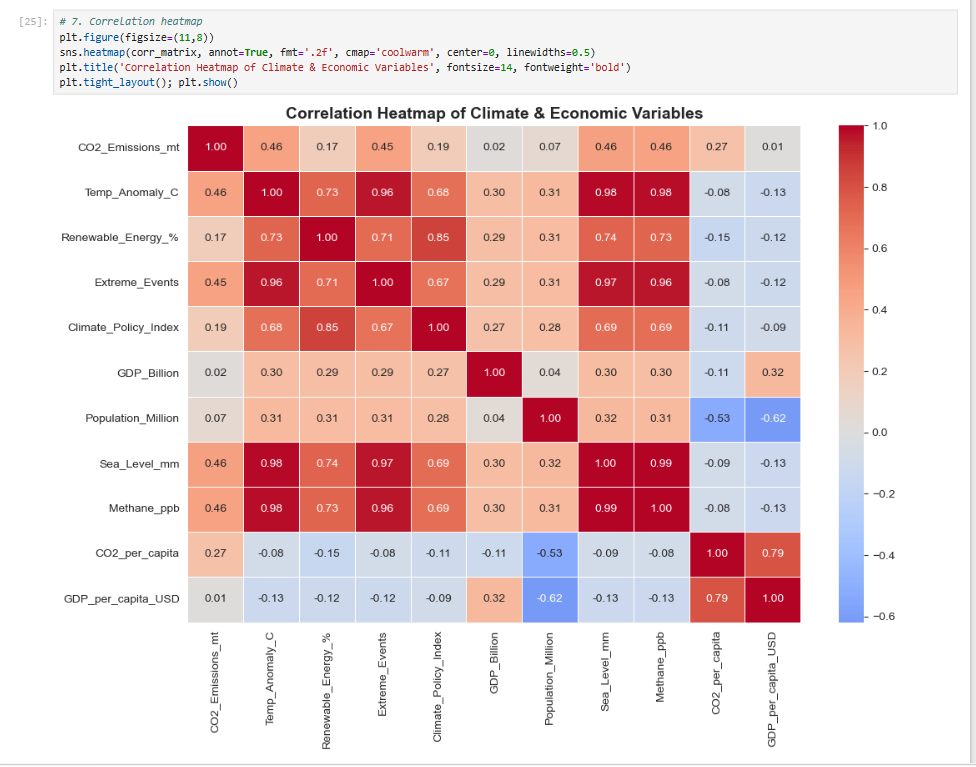

# 🌍 Global Climate Change Analysis (1940–2040)

A Data Analytics final project performing end-to-end Exploratory Data Analysis (EDA) on 100 years
of global climate data — combining real historical records with projected future scenarios to
understand how climate change unfolds under different policy paths.

## 📌 Problem Statement

How do CO2 emissions, temperature, renewable energy adoption, and climate policy differ across
four possible futures — **Historical**, **Current (2020–2026)**, **Business-As-Usual (BAU)**, and
**Green** — and what does that mean for the world by 2040?

## 📂 Dataset

- **Source:** [Global Climate Change (1940–2040)](https://www.kaggle.com/code/abdulmaliklodhra/global-climate-collapse-timeline-1940-2040) — Kaggle, by Abdul Malik Lodhra
- **Size:** 12,120 rows × 13 columns
- **Coverage:** 30 countries, 6 regions, 4 scenarios, spanning 1940–2040
- **Columns:** Year, Country, Region, Scenario, CO2 emissions, temperature anomaly, renewable
  energy %, extreme weather events, climate policy index, GDP, population, sea level, methane

## 📊 Sample Visualizations

**Correlation Heatmap** — how every variable relates to every other variable at a glance:




## 🗂️ Repository Contents

| File | Description |
|---|---|
| `Climate_Change.ipynb` | Full Jupyter Notebook — cleaning, EDA, 11 visualizations, forecasting, and insights |
| `climate_dataset_extended_1940_2040.csv` | Raw dataset (as obtained from source) |
| `Climate_Change_Full_Overview.pptx` | Full presentation deck covering all 4 tasks with charts |
| `images/` | Chart screenshots used in this README |

## 🔍 Project Workflow

1. **Data Loading & Overview** — shape, data types, summary statistics
2. **Data Cleaning** — checked for missing values and duplicates (none found), created 4 derived
   columns: `Decade`, `CO2_per_capita`, `GDP_per_capita_USD`, `Emissions_per_GDP`
3. **Exploratory Data Analysis** — univariate, bivariate, and multivariate analysis; groupby and
   pivot table comparisons across Region, Scenario, and Decade
4. **Visualizations** — 11 charts including line, bar, pie, histogram, box plot, scatter plot,
   correlation heatmap, and an interactive Plotly chart
5. **Insights & Conclusion** — key findings and recommendations based on the analysis

## 💡 Key Insights

1. Scenarios diverge sharply after 2020 — Green stabilizes warming, BAU keeps climbing
2. CO2 emissions and temperature anomaly are positively correlated (r ≈ 0.46)
3. Renewable energy adoption closely tracks the Climate Policy Index (r ≈ 0.85)
4. Temperature and sea level rise are almost perfectly linked (r ≈ 0.98)
5. Asia and North America are among the largest CO2 contributors
6. Extreme weather events are unevenly distributed across regions

## ✅ Conclusion

The path the world chooses matters enormously. Under a **Green** future, warming and emissions
stabilize. Under **Business-As-Usual**, they keep climbing — and the gap between these two futures
widens the further into the future the trend is projected.

## 🛠️ Tools Used

- Python, Pandas, NumPy
- Matplotlib, Seaborn, Plotly
- Jupyter Notebook

## 🚀 How to Run

```bash
pip install pandas numpy matplotlib seaborn plotly  jupyter
jupyter notebook Climate_Change.ipynb
```

Make sure `climate_dataset_extended_1940_2040.csv` is in the same folder as the notebook.

---
*Data Analytics Final Project — Global Climate Change (1940–2040)*
